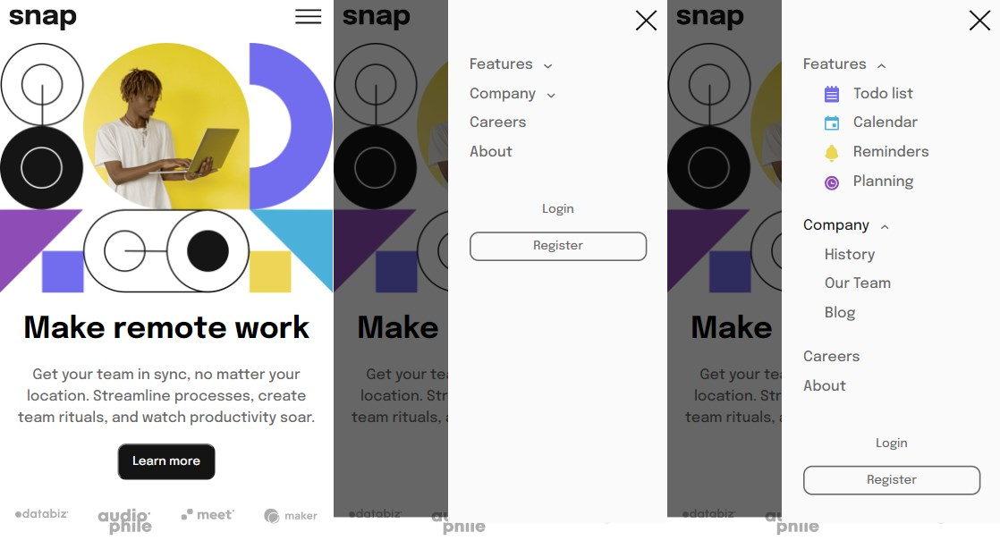
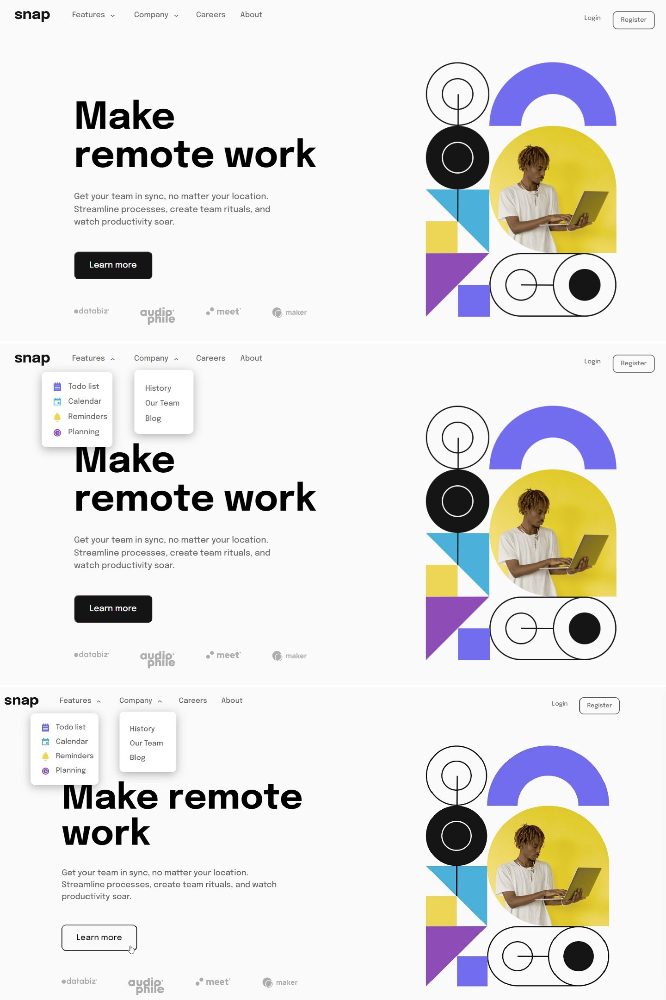

# Frontend Mentor - Intro section with dropdown navigation solution

This is a solution to the [Intro section with dropdown navigation challenge on Frontend Mentor](https://www.frontendmentor.io/challenges/intro-section-with-dropdown-navigation-ryaPetHE5). Frontend Mentor challenges help you improve your coding skills by building realistic projects. 

## Table of contents

- [Overview](#overview)
  - [The challenge](#the-challenge)
  - [Screenshot](#screenshot)
  - [Links](#links)
- [My process](#my-process)
  - [Built with](#built-with)
- [Author](#author)

## Overview

### The challenge

Users should be able to:

- View the relevant dropdown menus on desktop and mobile when interacting with the navigation links
- View the optimal layout for the content depending on their device's screen size
- See hover states for all interactive elements on the page

### Screenshot

---

### Links

- Solution URL: [Frontend Mentor](https://www.frontendmentor.io/solutions/intro-section-with-dropdown-navidagtion-with-flex-and-grid-hE376_SJO3)
- Live Site URL: [Github Pages](https://amrmabdelazeem.github.io/intro-section-with-dropdown-navigation/)

## My process

- Understand the Design: Analyze the layout, styling, and functionality required for the intro section and dropdown navigation.
- Create the HTML structure, use appropriate HTML elements, and make sure to include all necessary classes and IDs.
- Apply mobile-first approch.
- Apply the styles to achieve the layout and appearance described in the design.
- Use CSS Flexbox and Grid for positioning elements as needed.
- Implement responsive design to ensure the solution looks good on both mobiles (375px) and laptops (1440px).
- Build Laptop preview to fit the design using media queries and test it.
- Use Javascript to build the logic for dropdown lists.

### Built with

- Semantic HTML5 markup
- CSS custom properties
- Flexbox
- CSS Grid
- Mobile-first workflow
- Responsive design
- JavaScript

## Author

- Website - [Github](https://github.com/amrmabdelazeem)
- Frontend Mentor - [@amrmabdelazeem](https://www.frontendmentor.io/profile/amrmabdelazeem)
